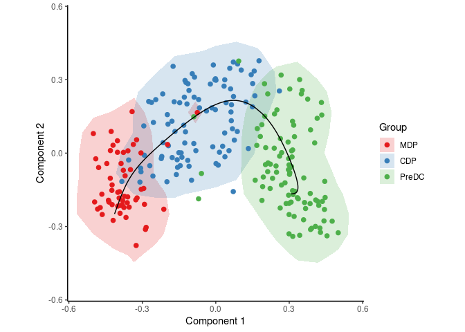
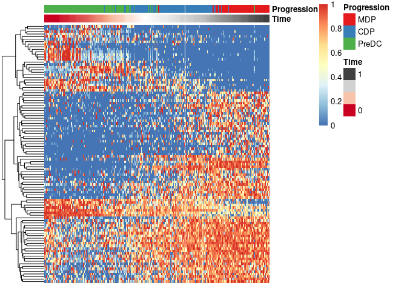
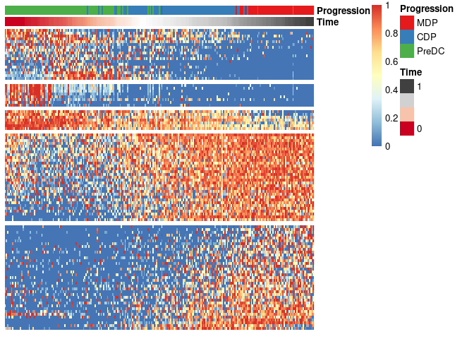

SCORPIUS
========

[](https://travis-ci.org/rcannood/SCORPIUS) [](https://ci.appveyor.com/project/rcannood/SCORPIUS) [](https://cran.r-project.org/package=SCORPIUS) [](https://codecov.io/gh/rcannood/SCORPIUS?branch=master)

**SCORPIUS an unsupervised approach for inferring developmental chronologies from single-cell RNA sequencing data.** In comparison to similar approaches, it has three main advantages:

-   **It accurately reconstructs linear dynamic processes.** The performance was evaluated using a quantitative evaluation pipeline and ten single-cell RNA sequencing datasets.

-   **It automatically identifies marker genes, speeding up knowledge discovery.**

-   **It is fully unsupervised.** Prior knowledge of the relevant marker genes or cellular states of individual cells is not required.

News:

-   See `news(package = "SCORPIUS")` for a full list of changes to the package.

-   A preprint is available on [bioRxiv](http://biorxiv.org/content/early/2016/10/07/079509). Run `citation("SCORPIUS")` to obtain the corresponding citation information.

-   Check out our [review](https://www.biorxiv.org/content/early/2018/03/05/276907) on Trajectory Inference methods!

Installing SCORPIUS
-------------------

You can install:

-   the latest released version from CRAN with

    ``` r
    install.packages("SCORPIUS")
    ```

-   the latest development version from github with

    ``` r
    devtools::install_github("rcannood/SCORPIUS", build_vignettes = TRUE)
    ```

If you encounter a bug, please file a minimal reproducible example on the [issues](https://github.com/rcannood/SCORPIUS/issues) page.

Learning SCORPIUS
-----------------

To get started, read the introductory example below, or read one of the vignettes containing more elaborate examples:

-   [Investigating differentiating dendritic cell progenitors](vignettes/ginhoux.md): `vignette("ginhoux", package="SCORPIUS")`
-   [Inferring trajectories from simulated data](vignettes/simulated-data.md): `vignette("simulated-data", package="SCORPIUS")`

Introductory example
--------------------

This section describes the main workflow of SCORPIUS without going in depth in the R code. For a more detailed explanation, see the vignettes listed below.

To start using SCORPIUS, simply write:

``` r
library(SCORPIUS)
```

The `ginhoux` dataset (See Schlitzer et al. 2015) contains 248 dendritic cell progenitors in one of three cellular cellular states: MDP, CDP or PreDC. Note that this is a reduced version of the dataset, for packaging reasons. See ?ginhoux for more info.

``` r
data(ginhoux)
expression <- ginhoux$expression
group_name <- ginhoux$sample_info$group_name
```

With the following code, SCORPIUS reduces the dimensionality of the dataset and provides a visual overview of the dataset. In this plot, cells that are similar in terms of expression values will be placed closer together than cells with dissimilar expression values.

``` r
space <- reduce_dimensionality(expression, correlation_distance)
draw_trajectory_plot(space, group_name, contour = TRUE)
```


To infer and visualise a trajectory through these cells, run:

``` r
traj <- infer_trajectory(space)
draw_trajectory_plot(space, group_name, traj$path, contour = TRUE)
```



To identify candidate marker genes, run:

``` r
# warning: setting num_permutations to 10 requires a long time (~30min) to run!
# set it to 0 and define a manual cutoff for the genes (e.g. top 200) for a much shorter execution time.
gimp <- gene_importances(
  expression, 
  traj$time, 
  num_permutations = 10, 
  num_threads = 8, 
  ntree = 10000,
  ntree_perm = 1000
) 
```

To select the most important genes and scale its expession, run:

``` r
gimp$qvalue <- p.adjust(gimp$pvalue, "BH", length(gimp$pvalue))
gene_sel <- gimp$gene[gimp$qvalue < .05]
expr_sel <- scale_quantile(expression[,gene_sel])
```

To visualise the expression of the selected genes, use the `draw_trajectory_heatmap` function.

``` r
draw_trajectory_heatmap(expr_sel, traj$time, group_name)
```



Finally, these genes can also be grouped into modules as follows:

``` r
modules <- extract_modules(scale_quantile(expr_sel), traj$time, verbose = F)
draw_trajectory_heatmap(expr_sel, traj$time, group_name, modules)
```



References
----------

Schlitzer, Andreas, V Sivakamasundari, Jinmiao Chen, Hermi Rizal Bin Sumatoh, Jaring Schreuder, Josephine Lum, Benoit Malleret, et al. 2015. “Identification of cDC1- and cDC2-committed DC progenitors reveals early lineage priming at the common DC progenitor stage in the bone marrow.” *Nature Immunology* 16 (7): 718–26. doi:[10.1038/ni.3200](https://doi.org/10.1038/ni.3200).
